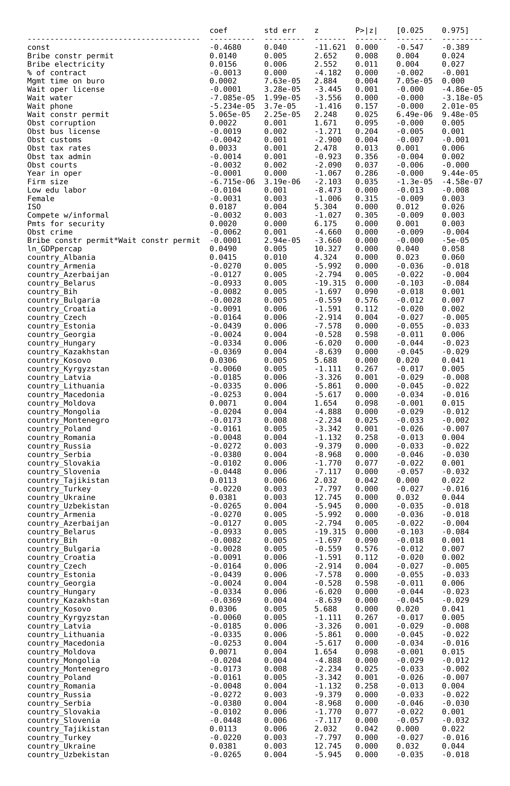
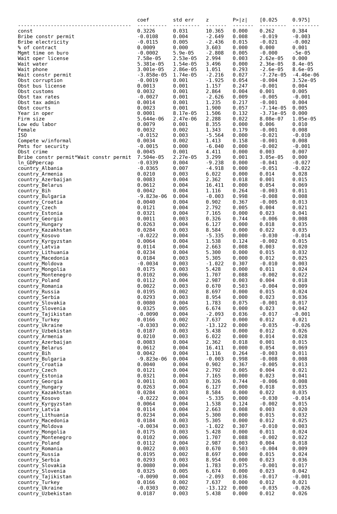
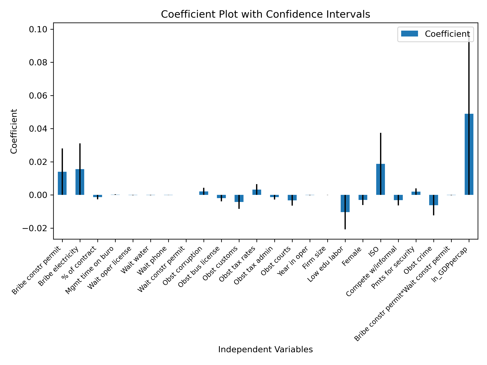
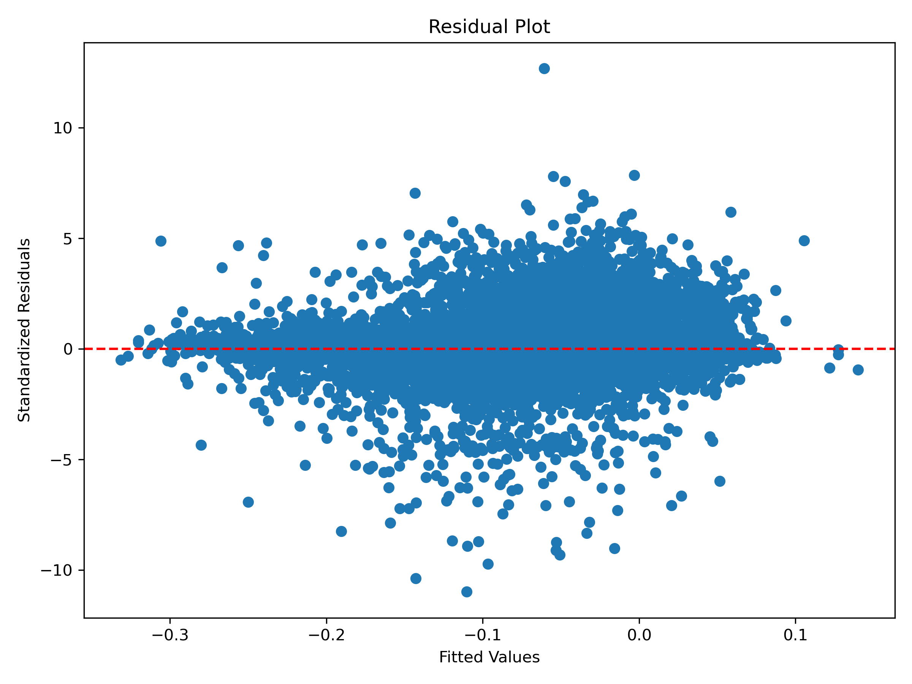
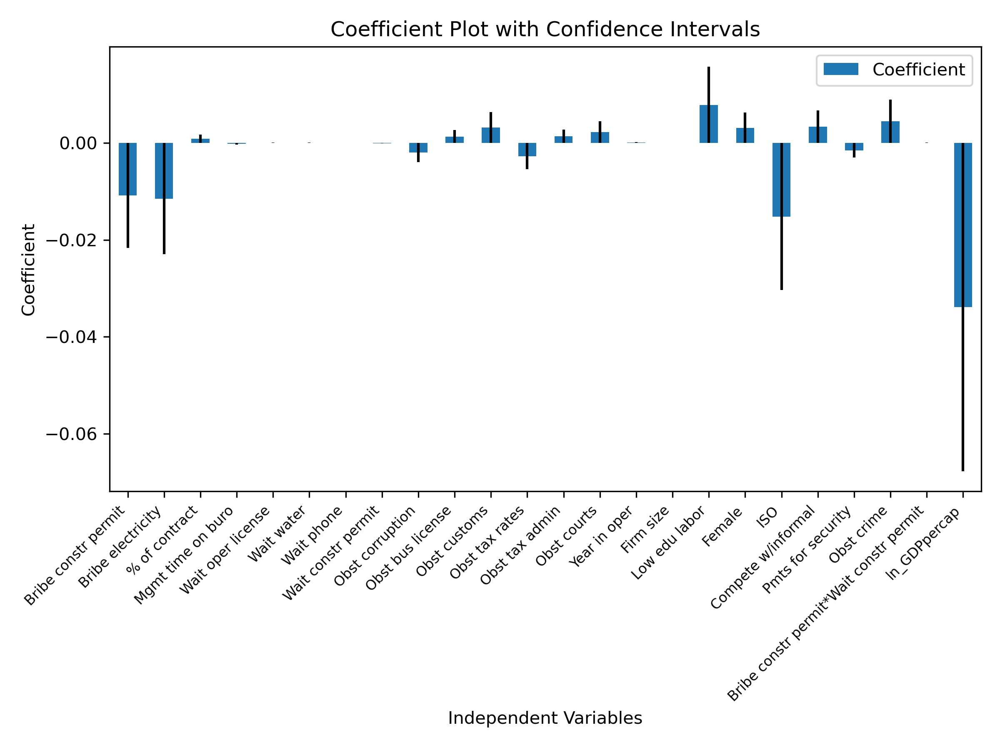
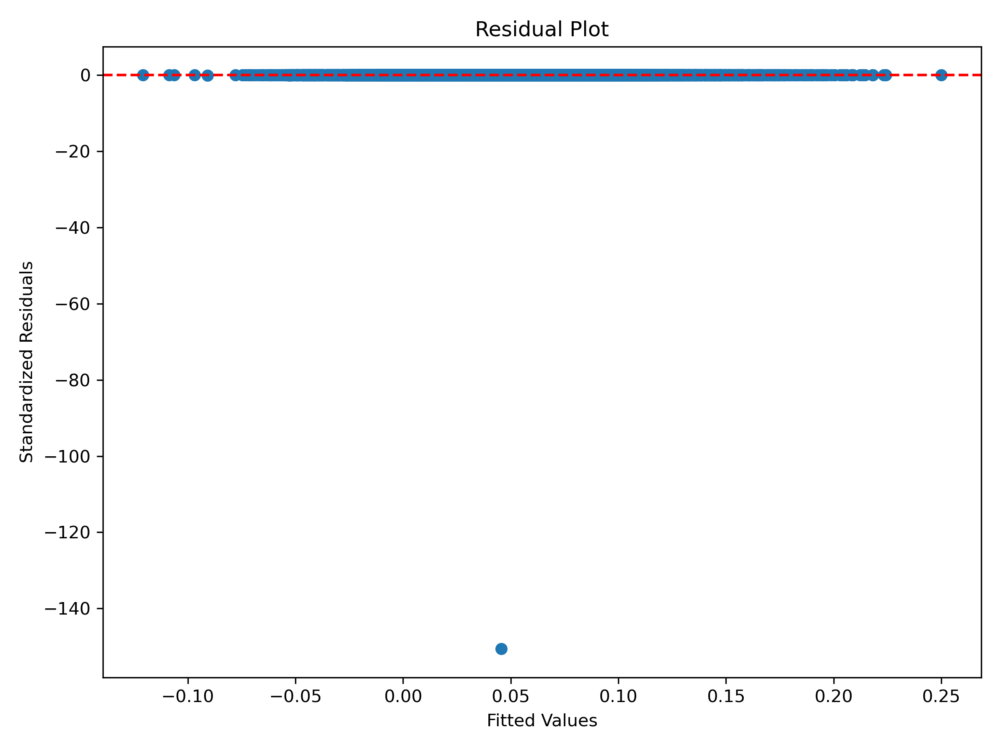

**Does Corruption Grease or Sand the Wheels of Growth**

This repository makes an attempt at replicating part of the analysis conducted by Kanybek Nur-tegin and Keith Jakee in their paper "Does Corruption Grease or Sand the Wheels of Development? New Results based on disaggregated data"

## The Data

This project is based on data from the World Bank's Enterprise Survey (WBES) Portal. Access to this data needs to be requested here: [Sign Up](https://login.enterprisesurveys.org/content/sites/financeandprivatesector/en/signup.html).
Particularly, this data is part of the rich firm-level datasets that the portal offers. 

This replication attempts to make use of firm level data covering the years 2008, 2009, 2012, and 2013. 
It also chooses to focus on data from Central Asia and Europe since limiting the study's scope was thought to improve the data's accuracy for that specific part of the world. There is also an element of convenience here since the dataset for some parts of the world is often limited. Firm level data from Pakistan, for example, was only collected for a single year. 
The years selected for the data simply account for more recent years than what the original study accounts for. Nur-tegin and Jakee have only looked at data until 2012, for example. 

If the user so chooses, they may download the datasets directly from here (after their request has been approved by the World Bank): ['datasets'](https://login.enterprisesurveys.org/content/sites/financeandprivatesector/en/library/library-detail.html/content/dam/wbgassetshare/enterprisesurveys/combineddata/eastern-europe-central-asia/BEEPS_2009_2013_Panel.zip).
Otherwise, the main dataset can be found in the repository too with the name "BEEPS_2009_2013_Panel.dta". This is inside the "assets" file. 

It should be noticed that the .dta format indicates that the data is designed to be viewed as Stata's native data format. 

GDP per capita data was also acquired from the World Bank's website. It can be downloaded here: [Download](https://databank.worldbank.org/reports.aspx?source=2&series=NY.GDP.PCAP.CD&country=#)
The data must be specified in a certain way. Time must be taken as columns, the countries as rows, and series as pages. 
We also restrict the years to 2008, 2009, 2012, and 2013. Any additional years will not make it to our analysis since they are not a part of the WBES dataset. 

## Attempted Extension 

This project seeks to accomplish three goals: 

1. Familiarize the researcher with recent methods being used in political and economic analyses. 
2. Extend the original paper with different econometric methods, a different window of time, a different regional focus, a different way to deal with the problem of missing variables, and ultimately a different final model specificaion. 
3. Attempt to work with firm-level panel data as opposed to country-level aggregated data that this researcher (Adil) has had limited experience with. 

Using data from the World Bank also creates a basis to work with similar datasets in the fields of politics and development.

## What is "cleaning.py"

This is the first py file that must be run. 

It seeks to combine the two datasets with firm level data and country level GDP per capita data. 

Additionally, it performs the necessary pre-processing to the WBES dataset to make it usable for further analysis. 

### Variables
While immediately it was thought that a different specification of variables might make more sense, I fell back on choosing the variables that the Nur-tegin and Jakee specifiy. 

These original variables, their new names, and their explanation are as follows: 

1. "country":"country": The name of the country of the firm
2. "year":"year": The year of the survey conducted
3. "GDP":"GDPpercap": The GDP per capita of that country in that year
4. "d2":"annualsales_1yrago": Annual firm sales last year
5. "n3":"annualsales_3yrsago": Annual firm sales three years ago
6. "j7a":"%sales": Percent of sales paid as bribes
7. "j15":"Bribe oper license": Bribe to get an operating license (dummy, 1 if "yes")
8. "j12":"Bribe import license": Bribe to get an import license (dummy, 1 if "yes")
9. "j5":"Bribe tax": Bribe to tax inspectors (dummy, 1 if "yes")
10. "g4":"Bribe constr permit": Bribe to obtain construction permits
11. "c5":"Bribe electricity": Bribe to get electrical connection	
12. "c14":"Bribe water": Bribe to get water connection	
13. "c21_2009":"Bribe phone": Bribe to get telephone connection	
14. "j6":"% of contract": % of contract value paid as bribe	
15. "j2":"Mgmt time on buro": Senior mngt’s time spent on red tape	
16. "j4":"# of tax visits": # of tax inspections	
17. "j14":"Wait oper license": Wait for operating license	
18. "j11":"Wait imp license": Wait for import license	
19. "c4":"Wait electricity": Wait for electrical connection	
20. "c13":"Wait water": Wait for water connection	
21. "c20_2009":"Wait phone": Wait for telephone connection	
22. "g3":"Wait constr permit": Wait for a construction permit	
23. "d4":"Wait customs": Wait to clear customs	
24. "h7a":"Fairness of courts": “Are courts fair?” 1 (str. disagree) to 4 (str. agree)	
25. "j30f":"Obst corruption": Obstacle to current operations: corruption, 0=no obst. to 4=severe obst.
26. "j30c":"Obst bus license": Obstacle: business licensing and permits,	0=no obst. to 4=severe obst.
27. "d30b":"Obst customs": Obstacle: customs and trade regulations, 0=no obst. to 4=severe obst.
28. "j30a":"Obst tax rates": Obstacle: tax rates, 0=no obst. to 4=severe obst.
29. "j30b":"Obst tax admin": Obstacle: tax administration, 0=no obst. to 4=severe obst.
30. "c30a":"Obst electricity": Obstacle: electricity, 0=no obst. to 4=severe obst.
31. "h30":"Obst courts": Obstacle: courts, 0=no obst. to 4=severe obst.
32. "b5":"Year in oper": Number of years in operation	
33. "l1":"Firm size": Number of full-time employees	
34. "l30b":"Low edu labor": Inadequate education of labor force	
35. "b4":"Female": Are any of the owners female?	
36. "b7":"Mgr experience": Top manager’s experience in the sector	
37. "b8":"ISO": International quality certification	
38. "e11":"Compete w/informal": Do you compete against informal firms	
39. "i2a":"Pmts for security": Percent of sales paid for security	
40. "i30":"Obst crime": Obstacle: crime, theft and disorder, 0=no obst. to 4=severe obst.	

### Missing Values
The problem of missing values is particularly important. To fix that, we take inspiration from the 
author's to use multiple imputation. The authors use the Mersenne Twister pseudorandom number generator with a fixed seed value. 
I instead used the ImperativeImputer technique to conduct my imputations. 
This is a popular technique according to the literature and uses other variables after an initial guess to estimate what the missing values would be. 
The technique sounds like a regression and actually uses the LGBMRegressor estimator. I specify my iterations to 10 to drawa balance between having enough iterations to make the estimates accurate and to not crash the python environment since it does have limited computational resources. 

The script has also corrected some coding for variables especially those which were binaries. 

## What is "regressions.py"

This script must be run after cleaning.py and conducts analysis on the csv file produced by the previous code.
There is significant departure between my regressions and the study's since the study does not document the exact specifications of the kinds of regressions they used. 

### Creating our dependent variables
Logarithmic transformations are applied to the 'annualsales_1yrago' and 'annualsales_3yrsago' columns.
The 'Sales Growth' variable is created as a weighted difference between the log-transformed sales. This is taken from the main study. 
Missing values and infinite values are handled by dropping respective rows.

We also define 'Annual %age change sales' as the average percentage growth in sales from 3 years ago and last year. This is our second dependent variable. 

### Interaction Terms
Here, I create interaction terms between the incidences of similar corruption variables and their associated obstacles. 
For example, an interaction term is made between whether a bribe took place to get a license and the wait-time it took to eventually get one. 

### Regression Analysis

#### Models 1 and 2: Robust Regression

The independent variables, including interaction terms and country dummies, are defined.
The robust regression model (HuberT) is fitted using the 'Sales Growth' variable and independent variables (everything else).
The summary and regression results are printed.
A summary image of the regression results is saved.

The second model uses the 'Annual %age change sales' as the dependent variable.

#### Model 3 and 4: Fixed Effects and OLS Regression

I thought I would use a fixed effects model to account for a possible OLS model which would also help me understand the extent to which the modelling departs from the assumptions of a normal OLS regression. 
I also thought that if I included fixed effects on my countries, I would be able to account for the variations in the different areas even within central asia and eastern europe. 
Alas though, my results were not favourable. I could not find any justifications to keep a model with very high p values on most of its coefficients. 

#### Model 5 and 6: Fixed Effects and Robust Regression

This was my robust regression models (HuberT) fitted with fixed effects. This improved my model in the sense that it made my coefficients more statistically significant and also made my coefficients more understandable. 

#### Model 6 and 8: Adjusted Independent Variables

I now kept my previous regression model but removed most of my variables which were very statistically insignificant (> 0.4). 

I was left with the following variables: 
1. 'Bribe constr permit'
2. 'Bribe electricity' 
3. '% of contract'
4. 'Mgmt time on buro'
5. 'Wait oper license' 
6. 'Wait water'
7. 'Wait phone' 
8. 'Wait constr permit'
9. 'Obst corruption'
10. 'Obst bus license'
11. 'Obst customs'
12. 'Obst tax rates'
13. 'Obst tax admin'
14. 'Obst courts'
15. 'Year in oper' 
16. 'Firm size'
17. 'Low edu labor' 
18. 'Female'
19. 'ISO'
20. 'Compete w/informal'
21. 'Pmts for security' 
22. 'Obst crime'
23. 'Bribe constr permit*Wait constr permit'
24. 'ln_GDPpercap'

The output can be seen here: 

Model 7: Dependent Var = Sales Growth 

Model 8: Dependent Var = Annual %age change sales

## Conclusion

We also produce 2 sets of coefficient and residual plots so summarize models 7 and 8 above. 

### Sales Growth
For Sales Growth as our dependent variable. 
Our coefficient plot is here: 
Our residual plot is here: 

### Annual %age change in sales
For Annual %age change sales as our dependent variable
Our coefficient plot is here: 
Our residual plot is here: 

### Discussion of Results

Taking our final model specifications, we find that different variables have different effects
on whether they "grease" or "sand" the wheels of growth. 

There is also a disparity between the results that I produce in these files and the regression results posted by the authors of the original study. 
This can be due to a number of reasons. The original authors had a wider dataset which covered a lot more geographic areas. They also incorporated the use of some
instrument variables which I could not include in my own models. 

I believe the residual plots can provide insights into what model would be preferred to make comments on. 
While model 8 has a residual plot where the points seem to be very close to 0, this seems a bit too "good" of a fit. 
Furthermore, there is one outlier that is very far away. 

The residual plot on the model 7 seems to be largely random.
Thus, we make comments on variables in this model. 

It seems that bribes to gain access to construction permits and electricity have a positive coefficient. 
This seems to suggest that giving bribes in these two areas leads to some economic gains which improves sales. 
Perhaps this is why there is a positive coefficient on the obst corruption variable too which suggests an environment which 
advantages such behavior. 

On the other hand, we seem to see that the obst customs variable has a negative coefficient. 
It is possible that customs in particular having obstructions is much more to the detriment of firm sales since it is harder to sidestep. 

We see negative and positive coefficient on low edu labor and ISO as expected. Low education leads to low sales and innovation leads to high sales. 

I would refrain from commenting on the exact coefficient magnitudes in this model since I am trying to be tentative with my model especially since I did not incorproate some of the instrument variables that the original authors did. 
Even so, the 1.4% and 1.5% improvement that giving bribes for construction permits and to get electricity connections seem small enough to be reasonable. 

It would be difficult to argue that corruption accounts for most of the variation in firm sales. This is why having more control variables in the future might be logical. 

Overall though, there seems to be a conflicting effect on different obstructions and corruption variables in the model. 
Thus, perhaps it depends on the specific act when deciding how it "greases" or "sands" growth. 

### Next steps
Taking this study further, perhaps we can experiment with more corruption specifications and model types such as a time series model or a machine learning model like the support vector regression model. 

